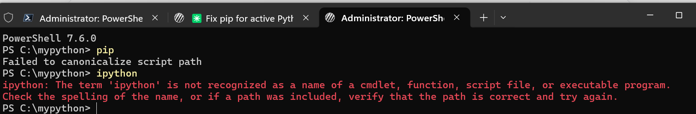

# Pip Fix — 2026-04-08

## Environment
- Python: 3.10.11 at `C:\Program Files\PsychoPy\python.exe` (PsychoPy bundled)
- Broken launcher: `C:\Program Files\PsychoPy\Scripts\pip.exe`

## Symptom
- `python -m pip --version` worked (pip 24.0)
- Bare `pip --version` failed with: `Failed to canonicalize script path`
- Cause: `pip.exe` launcher had a stale embedded path to a Python interpreter that no longer matched its current location.



## Fix
Force-reinstalled pip via the module entry point, which regenerates the `Scripts\pip.exe` launcher with the correct interpreter path:

```bash
python -m pip install --force-reinstall --no-deps pip
```

## Result
- pip upgraded 24.0 → 26.0.1
- `pip --version` now works directly:
  `pip 26.0.1 from C:\Program Files\PsychoPy\lib\site-packages\pip (python 3.10)`
